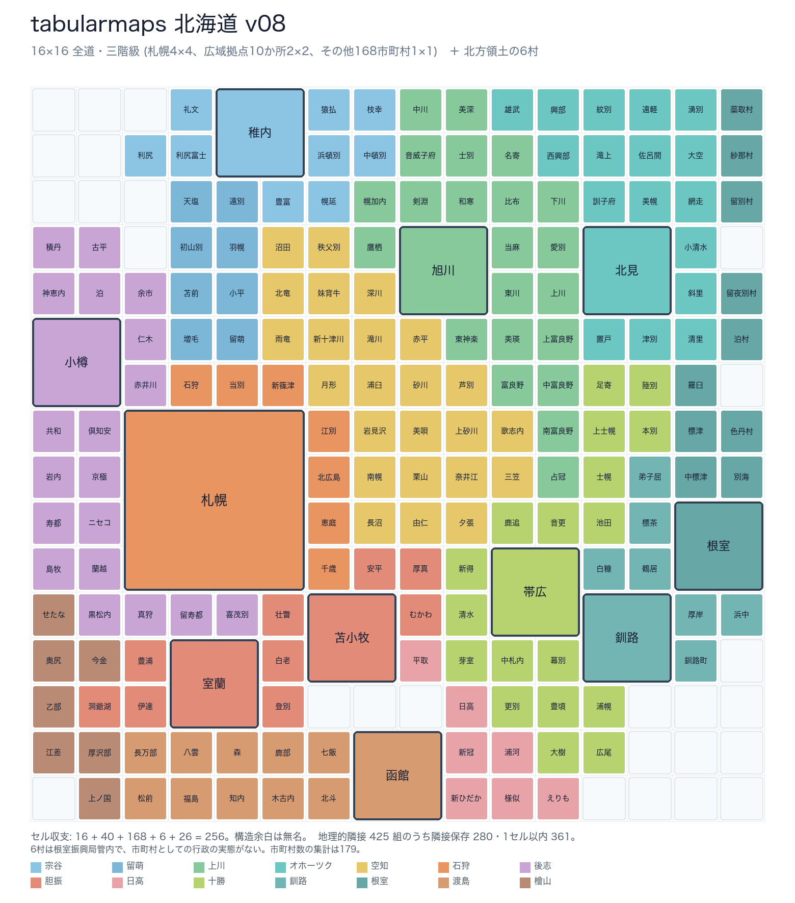

# tabularmaps / do — 北海道 179 市町村の 16×16 tabular map

北海道の 179 市町村を、ダッシュボードで一望できる固定 16×16 グリッドに圧縮した「表形式地図」と、
それを [Open MCT](https://github.com/nasa/openmct) のツリーに載せるプラグインです。



179 市町村だけの表示: [prototypes/v08/tabularmaps_hokkaido_v08.png](prototypes/v08/tabularmaps_hokkaido_v08.png)

- 札幌 4×4、広域拠点 10 か所 (函館・小樽・旭川・稚内・北見・苫小牧・室蘭・帯広・釧路・根室) 2×2、その他 168 市町村 1×1。
- 16 + 40 + 168 = 224 セルを占有し、残り 32 セルは無名の構造余白 (海・海峡・山脈の継ぎ目)。
- 北方領土の 6 村 (根室振興局管内の色丹村・泊村・留夜別村・留別村・紗那村・蘂取村) は、地図としては政府の慣行
  (地理院地図・全国市町村要覧の地図・国土数値情報) に合わせて東端の列に既定で描きます。市町村数の集計は
  北海道庁「道内 179 市町村」・総務省の市町村数と同じ 179 で、「北方領土の 6 村を含めない」で 179 だけの表示にできます。
- 振興局ごとの領土は人が描き (`design/territories-v08.txt`)、領土内の並び順だけを最適化器が解きます。
- 地理は一望性のために歪めますが、南北・東西の大まかな関係と振興局のまとまりは保ちます
  (役場の緯度で塗ると北→南に単調に濃→淡になることをダッシュボード上で確認できます)。

## 使う

### ダッシュボード (Open MCT)

公開版: https://tabularmaps.github.io/do/ (単体プレビュー: https://tabularmaps.github.io/do/preview.html)

`docs/` をそのまま静的配信します (GitHub Pages: main ブランチの /docs)。

```bash
python3 -m http.server 8765 --directory docs
```

- `http://localhost:8765/` — Open MCT。左のツリー「北海道 tabular map」を展開し、指標を選ぶと値でセルが塗られます。
- `http://localhost:8765/preview.html` — Open MCT なしで描画コアだけを確認するページ。

自分のデータをつなぐには `docs/demo-sources.js` の形で指標 (source) を定義し、`index.html` の
`TabularMapsPlugin({ sources: [...] })` に渡します。

```js
openmct.install(TabularMapsPlugin({
  dataUrl: './data/',
  includeNorthernTerritoriesVillages: true,    // 北方領土の 6 村を含めるか (既定 true。false で 179 市町村だけ)
  sources: [{
    key: 'pop', name: '人口密度', refreshMs: 600000,
    fetchValues: async () => ({
      label: '人口密度', unit: '人/km²', asOf: '2025-10-01',
      values: { '01100': 1780.2, '01202': 360.1 /* …コード→値… */ }
    })
  }]
}));
```

値の無い市町村は「無データ」色になります。振興局の色は無データ時の既定表示にだけ使い、
セルの塗りはダッシュボードのデータに明け渡します。

### 描画コアだけ使う

```html
<link rel="stylesheet" href="style.css">
<script src="tabularmap.js"></script>
<script>
  const map = TabularMap.create(document.getElementById('panel'), { layout, municipalities, wards });
  map.setSeries({ label: '…', unit: '…', values: { '01100': 12.3 } });
  map.setExpandSapporo(true);   // 札幌 4×4 を 10 区に展開
  map.setIncludeNorthernTerritoriesVillages(false);  // 北方領土の 6 村を含めない (既定は含める)
</script>
```

## データ

| ファイル | 内容 |
|---|---|
| `data/municipalities.json` | 179 市町村 + 北方領土 6 村のマスター (全国地方公共団体コード上 5 桁・振興局・区分・役場の概略座標・階級・status) |
| `data/layout-v08.json` | 現行の配置。`placements` (long-form、status 付き) が一次、`board` (179) / `board_all` (185) は派生、`structural_spaces` は余白 26 セル |
| `data/board.csv`, `data/board-with-villages.csv` | [tabularmaps/8bit](https://github.com/tabularmaps/8bit) 互換の 16×16 CSV (179 / 6 村込み) |
| `data/sapporo-wards.json` | 札幌 10 区の 4×4 内部配置 |
| `design/territories-v08.txt` | 振興局の領土図 (人手)。X が 6 村の席 |

## 版を作り直す

```bash
python3 scripts/count_territories.py design/territories-v08.txt   # 領土図のセル収支
python3 scripts/generate_layout.py --version v08                   # 配置生成 (numpy / scipy)
python3 scripts/validate_layout.py data/layout-v08.json            # 機械検証
python3 scripts/render_layout.py data/layout-v08.json prototypes/v08/tabularmaps_hokkaido_v08.png  # PNG (Pillow)
python3 scripts/render_layout.py data/layout-v08.json prototypes/v08/tabularmaps_hokkaido_v08_with_villages.png --with-villages
python3 scripts/export_board_csv.py data/layout-v08.json data/board.csv   # board.csv
python3 scripts/check_codes.py                                     # 総務省のコード一覧との突き合わせ (要ネット)
```

設計規約は [CLAUDE.md](CLAUDE.md)、経緯と却下案は [DECISIONS.md](DECISIONS.md)、前版は `prototypes/v07/`・`prototypes/v06/`。

## 一次情報源

- 北海道庁「総合振興局・振興局別市町村」 https://www.pref.hokkaido.lg.jp/link/shichoson/
- 総務省「都道府県コード並びに市区町村コード」 https://www.soumu.go.jp/denshijiti/code.html
- 総務省「市町村数」 https://www.soumu.go.jp/kouiki/kouiki.html
- 国土地理院「全国都道府県市区町村別面積調」 https://www.gsi.go.jp/KOKUJYOHO/MENCHO-title.htm
- 札幌市 区政概要・人口統計 https://www.city.sapporo.jp/shimin/shinko/kusei-suishin/gaiyo/index.html

## 兄弟プロジェクト

- [tabularmaps/8bit](https://github.com/tabularmaps/8bit) — ISO 3166-1 を 16×16 に
- tabularmaps/cldr — Unicode CLDR の地域識別子を等面積セルに (データ契約を共有)

## ライセンス

CC0 1.0 Universal
